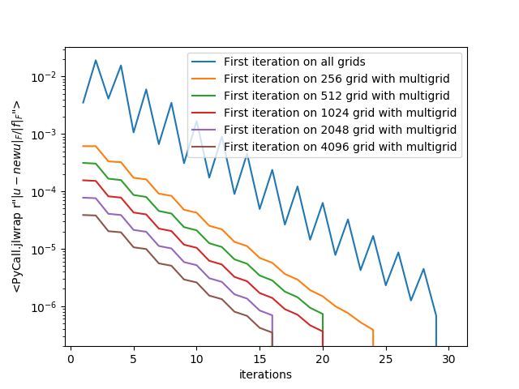

# NonlinearPDE
We will consider the following nonlinear elliptic PDE, which displays tunable non- linearity while still remaining relatively simple:


The iterative method we consider is by solving a Poisson equation:


For a toy problem, the iterative solver takes 29 top-level iterations and 1.211s to solve.
To accelerate the solver, we use geometric multigrid methods. We choose to use the full cycle as an initial guess for our  iterative solver.


The multigrid solver takes 20 top-level iterations and 0.891s to run, significantly accelerating the convergence and performs even better when the size of the problem is large.



For more details, please look into the [paper](paper.pdf) for more details.

## Testing

To run the jupyter testing, run `julia` in your command line, and enter:

```julia
using IJulia
notebook()
```

and open [test.ipynb](test.ipynb) to find the results. Or you may also just run
```bash
julia test.jl
```

You may also access the error decay on different size of problem by entering
```bash
julia test_error_decay.jl
```

##Acknowledgements
This project is a part of 18.335 Introduction to Numerical Methods at MIT Spring 2018. Thanks to [Wonseok Shin](http://www.mit.edu/~wsshin/) for his wonderful class and advices on the project, and to Nolan Reilly who I have been collaborating on this project.